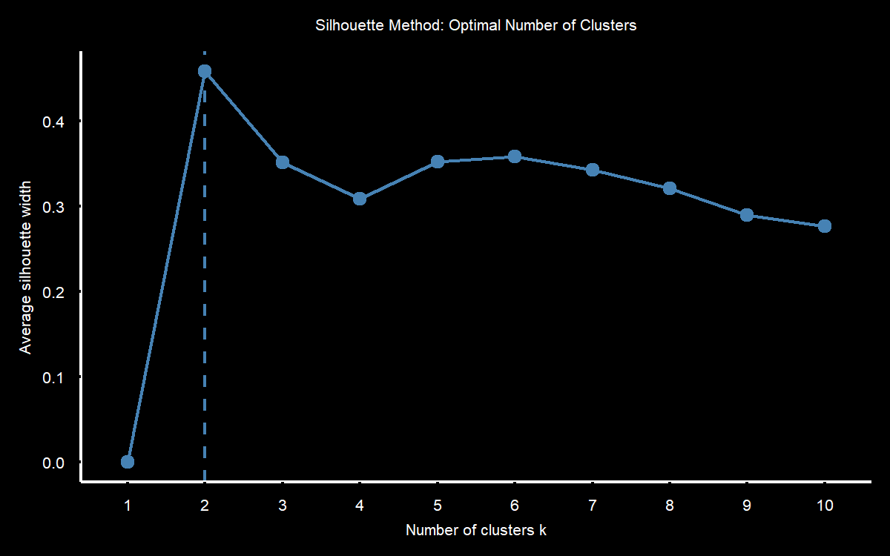

```{r setup, include=FALSE}
knitr::opts_chunk$set(echo = TRUE)
```


<style>
body {
text-align: justify;
background-color:black;
color:white;}
</style>

\


The average silhouette method is based on the total within-cluster variation. Precisely, it determines how well each observations lies within its cluster. To do so, the average silhouette of observations for different values of $K$ is computed.
The silhouette score ranges from -1 to 1. Generally, a good clustering solution is indicated by a high average silhouette. Hence, in the analysis, the number of clusters $K$ is chosen according to the highest average silhouette.

An exemplary plot for determining the optimal number of clusters $K$ is shown in the following figure: \




\
\

*Sources*

* *Chunhui Yuan and Haitao Yang, Research on K-Value Selection Method of K-Means Clustering Algorithm, Multidisciplinary Scientific Journal, 2019*

* *Stefan Mayer, Winter Term 2020/21, ML Applications in Business and Economics*