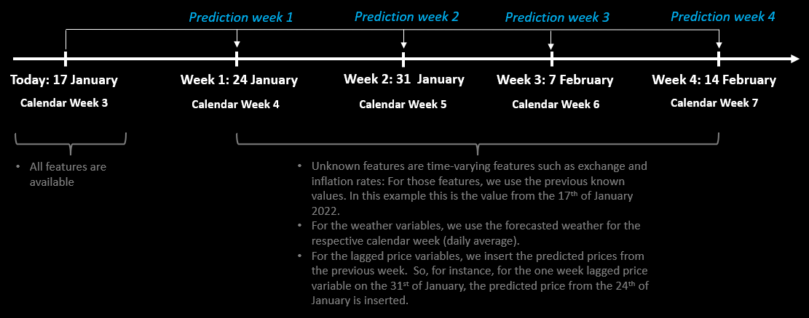

```{r setup, include=FALSE}
knitr::opts_chunk$set(echo = TRUE)
```

<!-- #### **How we make the price predictions** -->

<style>
body {
text-align: justify;
background-color:black;
color:white;}
</style>

\

Next, the user can make price predictions for the upcoming four weeks
for a food-type-size-country combination and wholesale market of his or
her choice. The predictions can be made with all 9 models introduced
in the 'Theory' tab. 

\

Assuming that today is the 17th of January, the idea of making price predictions
as well as the data generation process for unknown values is explained in the 
following figure:

\

<p align="center">
  
</p>


\

\

The price prediction tab is structured as follows:

* **Find Best Model**: In this tab, the user can find the model(s) which make(s) the most accurate predictions overall, for a 
fruit or vegetable as well as for a specific food-type-size-country combination.

* **Single Comparison**: In this tab, the user can explore the predicted vs. true values for a specific food-type-size-country combination for the full observations period, i.e., from 2016 until today, in detail. 

* **Market Comparison**: In this tab, the user can compare the predictions for a specific food-type-size-country combination across markets.

* **Model Comparison**: In this tab, the user can compare the predictions for a specific food-type-size-country combination across prediction models. 


